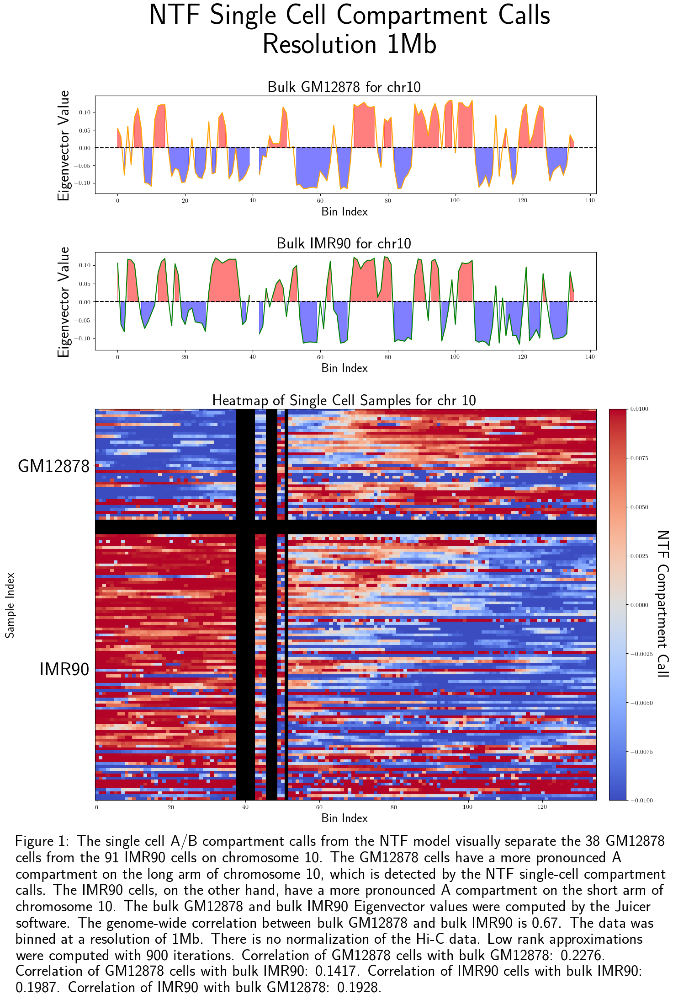
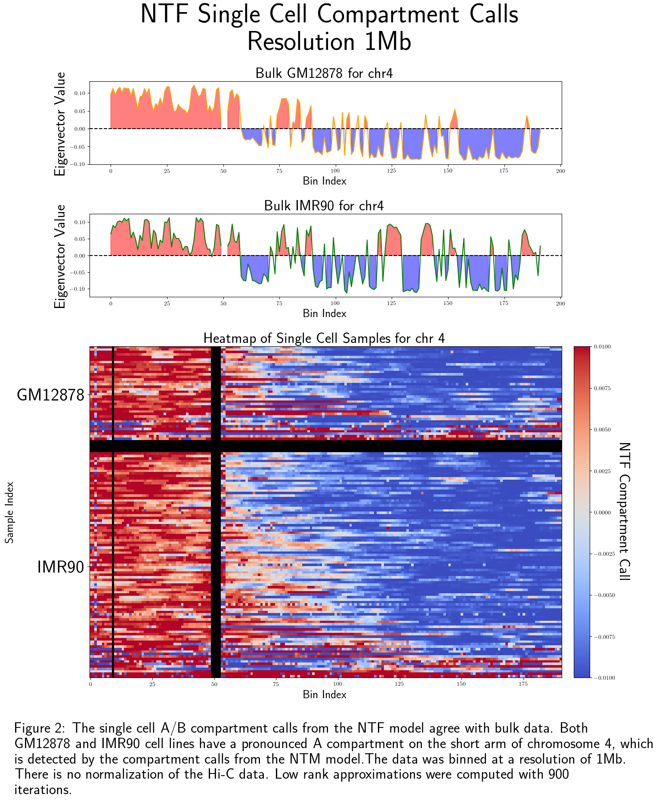

**ABSTRACT**

Advancements in single-cell multi-omics technologies have enabled the simultaneous measurement of various omics modalities within individual cells. Integrating multi-omics data while preserving the interaction information between different modalities remains an open challenge. Traditional methods lose critical interaction information by applying matrix methods. To address this, this research project proposes a Non-Negative Tensor Factorization (NTF) model for multi-omics integration. 

**The NTF model with Single-Cell Data**  

The 'ABcluster' command effectively distinguishes GM12878 and IMR90 cells based on their A/B compartment calls and their cell type factors. The 'ABcluster' command is designed to robustly analyze single-cell Hi-C, methylation, and chromatin accessibility data, outputting cell-type factors and single-cell A/B compartment calls. Additionally, 'ABcluster' can flexibly process inputs from any two of the above modalities or even just a single modality.

Below is a comparison of A/B compartment calls derived from single-cell methylation and chromatin conformation data using the scNOMe-HiC technique. These calls show a strong correlation with bulk eigenvectors for GM12878 and IMR90 on chromosome 4, as well as effectively separating the 38 GM12878 cells from the 91 IMR90 cells with the A/B calls from chromosome 11. In contrast, the A/B compartment calls generated by scHiCluster do not correlate well with bulk eigenvectors and fail to distinguish between the two cell lines for any chromosome. scHiCluster's method involves taking the inner product of the reference genome's CpG density vector with each column of the Hi-C matrix. The use of the reference genome likely contributes to its lack of precision in identifying distinct cell types. The 'ABcluster' approach offers a more accurate and reliable method for calling A/B compartments,

  <table style="margin: 0 auto;">
    <tr>
      <td></td>
      <td></td>
    </tr>
  </table>

  <table style="margin: 0 auto;">
    <tr>
      <td></td>
      <td></td>
    </tr>
  </table>

A/B compartments can be reliably called from both bulk Hi-C and bulk CpG methylation data. However, the methods used in bulk do not work well in the sparse single-cell setting. The 'ABcluster' command overcomes this difficulty by combining both the single cell data from both modalities. The resulting A/B compartments derived approximately half of their information from each modality, providing a balanced and integrated view of the chromatin architecture. This approach effectively addresses the challenges posed by sparse single-cell data, offering a novel and robust method for calling A/B compartments in single-cell experiments.

In bulk Hi-C data, A/B compartments are typically identified by first calculating the observed over expected contact frequencies, followed by Pearson’s correlation across the genomic bins, and, finally, performing an eigendecomposition. The 'ABcluster' command adapts this processing to single-cell Hi-C data first giving the off-diagonal entries more weight (single-cell version of the observed over expected) and then multiplying by the normalized transpose (single-cell version of Pearson’s correlation). In bulk CpG methylation data, A/B compartments can be reliably called by dividing the linear methylation data into bins and taking the KS statistic of each pair of bins. An eigendecomposition is then performed on the reuslting KS statistic matrix. The 'ABcluster' command adapts this processing to single-cell methylation data by taking the exterior product of the vectors of methylation values for each chromosome. This method assumes that the product of the methylation levels of bin i and bin j serves as a sufficient proxy for the interaction between these two bins. Off-diagonal entries of the methylation matrix are also given more weight, and the wieghted methylation matrix is also multiplying by the normalized transpose

This processesing converts the 1D methylation data for each cell into a 2D matrix. The processed Hi-C data for each chromosome and each cell is also a matrix. These matrices are comnined to form an n by n by 2 tensor, where n is the number of genomic bins of the chromosome. A rank two decomposition symmetric with repsect to the first compoennt is performed. The factor most correlated with an active epigenetic mark (from reference bulk data) is normalized and taken to be the A/B compartment call factor.    

When applying a rank-two approximation to a Pearson’s matrix, it typically yields two negatively correlated rank-one factors. The algorithm is designed to guide the results toward these two factors. However, as I demonstrated in the supplementary section, the checkerboard pattern observed can only be explained by the presence of two compartments, reinforcing the validity of this approach.

*Rank Two Decompositions Can also cluster cells*

I have already demonstrated that the NTF model can reliably call A/B compartment values both from bulk Hi-C and bulk methylation data. However, the methods for calling A/B compartments in bulk data do not perform well with sparse, single-cell data. Furthermore, tensor methods specifically designed for single-cell data also have not been able successfully call A/B compartment values. For example, Figure 5 shows that that scHiCluster cannot distinguish between A/B compartments of IMR90 and GM12878, even on differentially expressed bins.  I hypothesize that this issue can be addressed by integrating single-cell Hi-C and single-cell methylation data within the tensor framework. 

 , as input into the NTF model. The output was two latent factors, each corresponding to one of the cell lines. The 1D methylation data was first converted into symmetric, square matrices in order to integrate these modalities with the Hi-C contact matrices. Figure 7 shows a flowchart illustrating the integration of single cell Hi-C data and single cell methylation data with the NTF model. The model produced an experimental, sample, and genomic factors for each latent feature, such as cell type, from the integrated data. The experimental factors give the weight each data modality contributed to the factor, and the genomic factors give the weight each genomic bin contributed to the factor. 

**Background on the NTF Model**   
A matrix is more than a collection of vectors. The equality of row rank and column rank (Figure 1\) illustrates that there is a fundamental relationship between the rows and columns of a matrix. Information encoded in this relationship, such as eigenvalues, is lost when a matrix is reorganized as a vector. Similarly, if data can more naturally be viewed in three separate but interconnected ways \- as rows, columns, and pillars \- then information is lost when the data is organized as a matrix or as a collection of matrices. In this situation, it is more appropriate to organize the data as a 3-fold tensor (Figure 2).   

  <table style="margin: 0 auto;">
    <tr>
      <td></td>
      <td></td>
    </tr>
  </table>

A *d*\-fold tensor is an array of numbers that extends across *d* dimensions. It generalizes the concept of a matrix, which is a *2*\-fold tensor. A matrix is usually considered as a coordinatization of a linear mapping between vector spaces. This perspective highlights the serious shortcoming of matrices. Namely, matrices can only encode linear or degree two relationships in data. This shortcoming is inherent to all matrix methods since this limitation is inherent to matrices as a data structure. On the other hand, a tensor encodes multidimensional relationships in data. For example, a 3-fold tensor encodes the degree three information encoded in the relationship between the rows, columns, and pillars of the 3-fold tensor.  

A 3-fold rank one tensor is a 3-fold tensor whose rows span a one-dimensional vector space. A *d*\-fold rank one tensor is defined equivalently.  Every tensor is the sum of rank one tensors, and the rank of a tensor *B* is the minimum natural number *n* such that *B* is equal to the sum of *n* rank one tensors. Note that the rows of a 3-fold tensor span a one-dimensional vector space if and only if the columns and the pillars of the tensor span one-dimensional vector spaces as well. It is in this sense that rank one tensors are a natural class of simplest nontrivial tensors. Thus, the rank of a tensor is a natural measurement of a tensor’s complexity.   

Low-rank tensor factorization decomposes a tensor as the sum of *r* rank one tensors for some natural number *r*. These rank one components are naturally interpreted as latent factors that best explain the information encoded in the relationships between the slices of the tensor. Hence, low-rank tensor factorization is an algorithm that extracts latent features from a tensor while preserving the relationships between the rows, columns, and pillars of a tensor, as well as preserving the information encoded in the relationships between all of the other slices of a tensor.   

Non-negative tensors are particularly well-behaved. Although the problem of finding low rank approximations of real tensors is ill-posed in general \[De Silva & Lim, 2008\], the problem of finding low rank approximations of non-negative real hypermatrices is generally well-posed \[Qi *et al.*, 2016\]. Furthermore, such approximations are uniquely identifiable by Kruskal’s Theorem \[Rhodes, 2010\]. Thus, this paper develops a non-negative low rank tensor approximation model, and demonstrates that this mdodel is particularly well-suited for extracting latent factors from multi-omics biological data. Figure 3 shows a visualization of the input and the output of the model.  

For every non-negative *d*\-fold tensor *B* and every natural number *r* less than *d*, there exists a unique rank *r* approximation of *B*. Furthermore, there are known theoretical algorithms to find the unique low-rank approximation. Unfortunately, no such algorithms have been implemented. However, there are many fast and accurate algorithms to find approximations of such optimal low rank approximations, such as the sdf\_nls function from the Matlab package Tensorlab \[Vervliet *et al.*, 2016\]. It is an open question whether these approximations of optimal low rank approximations of a tensor *B* are sufficient low rank approximations of *B* themselves. The results presented in this paper demonstrate that an approximation of the optimal rank *r* approximation of a *d*\-fold tensor is indeed sufficient to extract the *d*\-dimensional information encoded in the relationship between the slices of the tensor.

    

**The NTF model with Synthetic Data**  
Many tensor models, such as scHiCluster \[Zhou *et al.*, 2019\], reshape tensor data into a matrix. The scatter plots in Figure 4 illustrate how reshaping a tensor into a matrix can result in the loss of crucial information from the original tensor. The NTF model, on the other hand, decomposes the original tensor as a unified entity, without losing information between the slices of the tensor. In Figure 4, a 3-fold tensor representing synthetic data is depicted. Visually, it is evident that this tensor consists of six types of matrix slices, each representing a distinct cell type. Each type of matrix slice is more similar to slices of the same cell type than to those of different types. The bottom left scatter plot in Figure 4 shows that tensor decomposition effectively recovers a unique factor for each cell type. The sample components of the cell type factors derived from the NTF model can be used to accurately cluster the cells according to their types. On the other hand, the bottom right scatter plot shows that a matrix decomposition of the tensor, after being reshaped into a matrix, fails to cluster the cells correctly. In fact, in this case, a matrix decomposition incorrectly identifies three clusters that do not exist in the original data. Figure 5 shows that matrix reshaping methods are only comparable to tensor methods for matrices with simplified structure. 

  <table style="margin: 0 auto;">
    <tr>
      <td></td>
      <td></td>
    </tr>
  </table>

**The NTF model with Bulk Data**  
Rank Two Decompositions of Bulk Hi-C and Bulk DNA Methylation Data Produces A/B Compartment Factors  
One of the most striking characteristics of Hi-C heatmaps is their intrachromosomal checkerboard pattern. The checkerboard-like pattern suggests that each chromosome is clustered into two components, referred to as A/B compartments in Lieberman-Aiden *et al.* \[2009\]. For the NTF model to identify A/B compartments from bulk Hi-C data, the intrachromosomal contact matrices were processed as follows. First, the correlation matrix of each intrachromosomal contact matrix was computed, and then translated by one to make the matrix non-negative. Next, the square matrix was converted into a 3-fold tensor by downsampling to create additional slices. In this context, an 80% downsampled matrix is the matrix that results from modifying the original matrix by replacing 20% of its entries randomly with zeros. The model takes as input a non-negative real tensor tensor​ whose *ijk*\-th entry represents the interaction between genomic bin *i* and genomic bin *j* in the *k*\-th downsampled matrix of the translated correlation Hi-C matrix. The number of downsampled slices did not affect the outcome, suggesting the rank one components of the decomposition are meaningful. Denote the downsampled processed interaction tensor by C and its entries by c*ijk*.The NTF model produces non-negative real numbers *hti* and *wti* such that for some small natural number *r* and all *i*, *j*, and *k* in the appropriate range, the following relationship holds:  
![][image4]  
The scalar *ht*i is naturally interpreted as the weight of factor *t* with respect to genomic region *i*, and *wtk* is naturally interpreted as the weight of factor *t* with respect to dataset *k*. Taking *r* to be 2, this factorization can be written in tensor notation as:  
![][image5]  
which will also be denote as C ≈ h1 ⊗ h1 ⊗ w1 \+ h2 ⊗ h2 ⊗ w2 in this proposal. For rank two decompositions, the factors h1 and h2 were the A/B compartments, as demonstrated in Figure 6\. Since the factors are independent of the experiments, it should follow that wt \= wu for all *t, u* up to a multiplicative constant. This was confirmed in practice. Furthermore, wtk always equaled the number of reads of experiment *k*, further validating the model.   
A/B compartments can also be derived from downsampled tensors of bulk methylation data. The process begins by converting the 1D methylation data into a non-negative symmetric matrix before downsampling and inputting the resulting tensor into the NTF model. Specifically, to derive A/B compartments with the NTF model, bulk DNA methylation data is processed in the following steps:

1. **Binarization**: The 1D methylation data is binarized in two stages. Initially, the data is divided into large bins, and then these large bins are further subdivided into smaller bins.  
2. **Integration**: The methylation values are integrated over the smaller bins. The integral values are the entries of the large bins.   
3. **KS-statistic**: The two-sample Kolmogorov-Smirnov (KS) statistic is computed for each pair of large bins. The first slice of the tensor is formed by creating a matrix where each *ij*\-th entry is the negative logarithm of the offset p-value of the two-sample KS-statistic for each pair of large bins.  
4. **Downsampling**: The remaining slices of the tensor are created by downsampling this original matrix. A rank two or three decomposition is then performed on the downsampled tensor. 

The out of this pipeline for H3K4me1 and CpG methylation are presented in Figure 6\. The strong negative correlation between the two NTF factors supports the hypothesis that these factors correspond to the A/B compartments. In the scatterplots of Figure 6, genomic bins are colored according to their compartment scores, computed using the Aiden lab's ‘eigenvector’ command \[Neva *et al.*, 2016\]. The color gradient aligns with these ‘eigenvector’ scores, further reinforcing the hypothesis that the NTF factors represent A/B compartments. The correlation between the tensor factors and the Aiden lab’s ‘eigenvector’ scores is higher for the Hi-C data compared to the methylation data. This is expected, as the tensor Hi-C factors and the Aiden lab’s ‘eigenvector’ scores were both derived from the same data. The methodology for computing A/B compartment scores from bulk methylation data is similar to that used by Liu *et al.* \[2019\] and Fortin and Hansen \[2015\], who derived A/B compartment calls from bulk histone methylation patterns and bulk methylcytosine patterns, respectively.  

    

Rank Three Decompositions of Bulk Hi-C and Bulk Methylation Data Produce a TAD Factor	  
In bulk Hi-C data, A/B compartment calls can be reliably called by taking eigenvectors of the correlation matrices of normalized intrachromosomal contact matrices. Typically, such analyses only use one eigenvector, and the remaining eigenvectors along with all the eigenvalues are discarded. However, these discarded eigenvalues and eigenvectors also hold biological meaning. Therefore, it is more appropriate to use a low-rank tensor decomposition rather than an eigendecomposition, as low-rank tensor decompositions retain all the information in the original data. This reasoning motivates the use of the NTF model. This section demonstrates that more than two factors from the NTF model are indeed biologically meaningful by showing that one of the factors from a rank three decomposition corresponds to Topologically Associated Domain (TAD) boundaries \[Dixon *et al*., 2012\].  
Dixon and colleagues developed a statistic termed the ‘directionality index’ to quantify the degree of interaction bias in Hi-C data for each genomic region. TAD boundaries are then inferred by observing where the directionality index varies considerably. Figure 7 shows that a factor from the NTF model corresponds with directionality index. 

**Potential Pitfalls and Alternative Approaches**  
 The above methods store the data from each modality and each cell as a correlation matrix. This results in a 4-fold tensor. Just as matrices only capture linear relationships in datasets, 4-fold tensors only encode the  degree four relationships in the data. If the above methods are not successful in producing cell type factors or single-cell A/B compartment values, I will enhance the method by considering cumulant tensors rather than correlation matrices. Whereas correlation coefficients capture degree one correlation information, the second cumulant tensor encodes degree two information. Cumulant tensors and hypercorrelation coefficients are defined in Figure 10\. Thus, if the strategy outlined above is not successful, I will improvedon the strategy by using cumulant tensors to capture higher-degree relationships in the data.  
   

    

**References**

1. De Silva, V., & Lim, L. H. (2008). Tensor rank and the ill-posedness of the best low-rank approximation problem. *SIAM Journal on Matrix Analysis and Applications*, *30*(3), 1084-1127.  
     
2. Qi, Y., Comon, P., & Lim, L. H. (2016). Uniqueness of nonnegative tensor approximations. *IEEE Transactions on Information Theory*, *62*(4), 2170-2183.  
     
3. Rhodes, J. A. (2010). A concise proof of Kruskal’s theorem on tensor decomposition. *Linear Algebra and its Applications*, *432*(7), 1818-1824.  
     
4. Zhou, J., Ma, J., Chen, Y., Cheng, C., Bao, B., Peng, J., ... & Ecker, J. R. (2019). Robust single-cell Hi-C clustering by convolution-and random-walk–based imputation. *Proceedings of the National Academy of Sciences*, *116*(28), 14011-14018.  
     
5. Lieberman-Aiden, E., Van Berkum, N. L., Williams, L., Imakaev, M., Ragoczy, T., Telling, A., ... & Dekker, J. (2009). Comprehensive mapping of long-range interactions reveals folding principles of the human genome. *science*, *326*(5950), 289-293.  
     
6. Dixon, J. R., Selvaraj, S., Yue, F., Kim, A., Li, Y., Shen, Y., ... & Ren, B. (2012). Topological domains in mammalian genomes identified by analysis of chromatin interactions. *Nature*, *485*(7398), 376-380.  
     
7. Vervliet, N., Debals, O., Sorber, L., Van Barel, M., & De Lathauwer, L. (2016). Tensorlab user guide. *Available on: http://www. tensorlab. Net*.  
     
8. Fortin, J. P., & Hansen, K. D. (2015). Reconstructing A/B compartments as revealed by Hi-C using long-range correlations in epigenetic data. *Genome biology*, *16*, 1-23.  
     
9. Liu, Y., Liu, T. Y., Weinberg, D. E., White, B. W., De La Torre, C. J., Tan, C. L., ... & Haque, I. S. (2019). Spatial co-fragmentation pattern of cell-free DNA recapitulates in vivo chromatin organization and identifies tissues-of-origin. *BioRxiv*, 564773\.  
     
10. Landsberg, J. M. (2011). *Tensors: geometry and applications: geometry and applications* (Vol. 128). American Mathematical Soc.  
      
11. Neva C. Durand, Muhammad S. Shamim, Ido Machol, Suhas S. P. Rao, Miriam H. Huntley, Eric S. Lander, and Erez Lieberman Aiden. "Juicer provides a one-click system for analyzing loop-resolution Hi-C experiments." Cell Systems 3(1), 2016\.

12. Horvath, S. (2013). DNA methylation age of human tissues and cell types. *Genome biology*, *14*, 1-20.

13. Lu, A. T., Quach, A., Wilson, J. G., Reiner, A. P., Aviv, A., Raj, K., ... & Horvath, S. (2019). DNA methylation GrimAge strongly predicts lifespan and healthspan. Aging (albany NY), 11(2), 303\.

14. Liu, Y., Reed, S. C., Lo, C., Choudhury, A. D., Parsons, H. A., Stover, D. G., ... & Kellis, M. (2024). FinaleMe: Predicting DNA methylation by the fragmentation patterns of plasma cell-free DNA. *Nature Communications*, *15*(1), 2790\.  
      
15. Abe, K., Maunze, B., Lopez, P. A., Xu, J., Muhammad, N., Yang, G. Y., ... & Lauberth, S. M. (2024). Downstream-of-gene (DoG) transcripts contribute to an imbalance in the cancer cell transcriptome. *Science Advances*, *10*(27).

16. Nava, M. M., Miroshnikova, Y. A., Biggs, L. C., Whitefield, D. B., Metge, F., Boucas, J., ... & Wickström, S. A. (2020). Heterochromatin-driven nuclear softening protects the genome against mechanical stress-induced damage. *Cell*, *181*(4), 800-817.  
      
17. Singh, P. B., & Zacouto, F. (2010). Nuclear reprogramming and epigenetic rejuvenation. Journal of biosciences, 35(2), 315\.  
      
18. Ocampo, A., Reddy, P., Martinez-Redondo, P., Platero-Luengo, A., Hatanaka, F., Hishida, T., ... & Belmonte, J. C. I. (2016). In vivo amelioration of age-associated hallmarks by partial reprogramming. *Cell*, *167*(7), 1719-1733.  
      
19. Gurdon, J. B., Elsdale, T. R., & Fischberg, M. (1958). Sexually mature individuals of Xenopus laevis from the transplantation of single somatic nuclei. Nature, 182(4627), 64-65.  
      
20. Takahashi, K., Tanabe, K., Ohnuki, M., Narita, M., Ichisaka, T., Tomoda, K., & Yamanaka, S. (2007). Induction of pluripotent stem cells from adult human fibroblasts by defined factors. *cell*, *131*(5), 861-872.

21. Shiels, P. G., Kind, A. J., Campbell, K. H., Wilmut, I., Waddington, D., Colman, A., & Schnieke, A. E. (1999). Analysis of telomere length in Dolly, a sheep derived by nuclear transfer. *Cloning*, *1*(2), 119-125.
