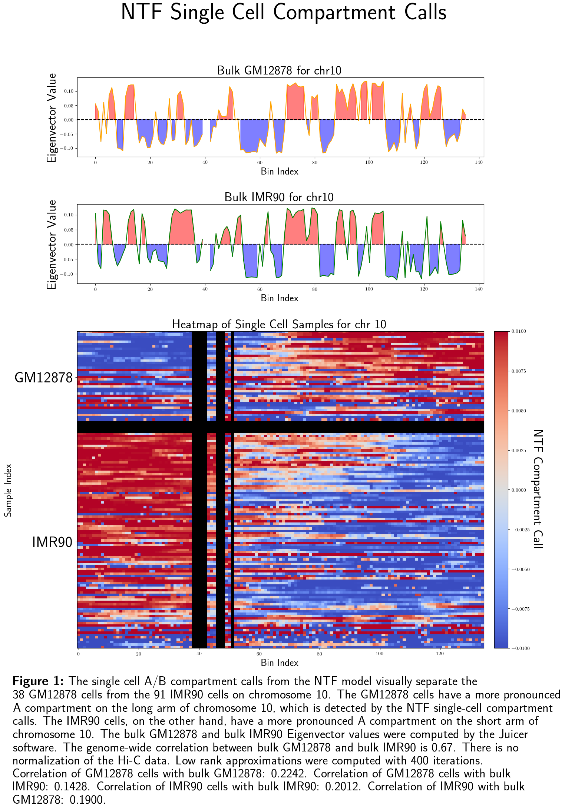
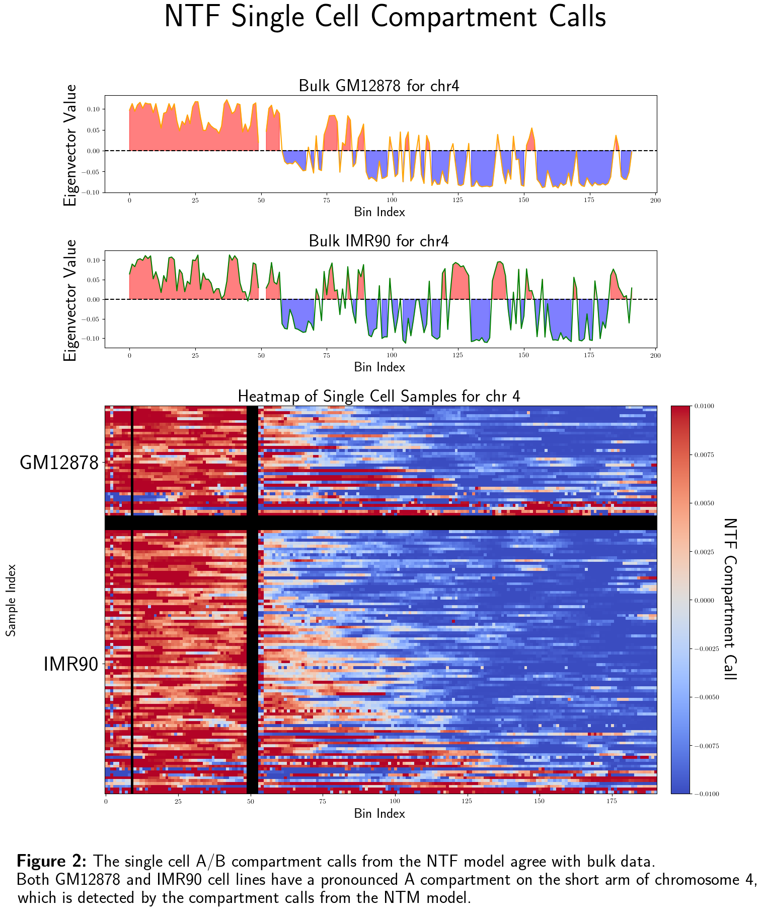

# Hypermatrix

Hypermatrix is a command-line tool designed for the integration of multi-omics data, as well as general epigenetic data analysis using tensor techniques.

The 'ABcluster' command processes single-cell CpG methylation and single-cell chromosome conformation data to perform cell-type clustering, single-cell A/B compartment identification, and single-cell TAD boundary detection. This command is compatible with data from techniques like sn-m3C-seq (as described by Dong-Sung Lee et al. in Nature Methods, 2019) and the single-cell version of NOMe-HiC (described by Hailu Fu et al. in Genome Biology, 2023). 'ABcluster' is particularly useful for tracking the diversity of A/B compartments within cells of the same type. This tool can be used to test the hypothesis that the diversity in A/B compartments within a cell-type increases with the age of an organism.

The 'differentiate_chromosomes' command processes Hi-C data, optionally combined with other epigenetic modalities, to produce distinct A/B compartment calls for each homologous chromosome. Unlike 'ABcluster', which relies solely on intrachromosomal contacts, 'differentiate_chromosomes' uses both intra- and interchromosomal contacts. The folding of chromatin in 3D space is an important part of gene regulation, ensuring that certain genes are transcribed simultaneously and that their transcripts are spatially close for further processing. The 'differentiate_chromosomes' command can be used to test the hypothesis that diploid cells use two distinct regulatory configurations for each homologous chromosome, with each 3D conformation likely being mutually exclusive to the other. For example, for one folding program to position certain genes in an active transcriptional hub, it may have to seperated other genes that also need to be clustered. Diploidy provides a solution to this problem. Diploidy offers more than just a backup copy of each chromosome; it provides cells with additional regulatory complexity by enabling the use of two mutually exclusive folding programs simultaneously. Additionally, the 'differentiate_chromosomes' command measures the degree to which each chromosome is associated with the nuclear lamina.

Advancements in single-cell multi-omics technologies have enabled the simultaneous measurement of various omics modalities within individual cells. Integrating multi-omics data while preserving the interaction information between different modalities remains an open challenge. Traditional matrix methods lose critical interaction information. To address this, this project proposes a Non-Negative Tensor Factorization (NTF) model for multi-omics integration called 'Hypermatrix'.

## Visualization

Below is the heatmap comparing the bulk eigenvectors of GM12878 and IMR90 with single-cell compartment calls. The first 38 cells are GM12878.

<div style="text-align: center;">
  <table style="margin: 0 auto;">
    <tr>
      <td></td>
      <td></td>
    </tr>
  </table>
</div>

## Installation

### Prerequisites

Ensure you have `conda` installed. If not, you can install it from [here](https://docs.conda.io/projects/conda/en/latest/user-guide/install/index.html). The packages `pyBigWig`, `h5py`, `hic-straw`, and `scHiCluster` are required and will be installed during the process below. If any of the required packages are not properly installed, you may need to install them separately.

### Steps

1. Clone the repository:

    ```bash
    git clone https://github.com/DavidWarrenKatz/hypermatrix.git
    ```

2. Navigate into the cloned directory:

    ```bash
    cd hypermatrix
    ```

3. Install the Hypermatrix tool and its dependencies:

    ```bash
    make install
    ```

4. Activate the Conda environment:

    ```bash
    conda activate hypermatrix
    ```

5. Verify the installation:

    ```bash
    hypermatrix --version
    ```

    This command should display something like:
    
    ```
    Hypermatrix version 0.1 - A tool for integrating multi-omics data and epigenetic analysis using advanced tensor techniques.
    ```


Here’s the updated version of the ABcluster command description with the mention of the `config.py` file for parameter adjustments:

---

### ABcluster Command

The `ABcluster` command is used to perform single-cell A/B compartment analysis and identify cell-type clusters by integrating single-cell CpG methylation data and Hi-C data. This command allows for flexible analysis by utilizing one or both data modalities depending on the user's input.

#### General Syntax

```bash
hypermatrix ABcluster --methy <path_to_methylation_directory> --hic <path_to_hic_directory> --output_dir <output_directory>
```

#### Input Parameters

- **`--methy <path_to_methylation_directory>`**: This specifies the directory containing the single-cell CpG methylation files. These files must be named following the pattern `<prefix>.bw`, where `<prefix>` is a unique identifier for each sample.
  
- **`--hic <path_to_hic_directory>`**: This specifies the directory containing the single-cell Hi-C files. These files must follow the naming pattern `<prefix>.hic`, where `<prefix>` matches the one used in the methylation files for proper integration.

- **`--output_dir <output_directory>`**: This specifies the directory where the output results will be stored. Ensure this directory exists or is created before running the command.

#### Configurable Parameters

The parameters for the `ABcluster` command are listed in the file `config.py`, where they can be adjusted to meet specific needs or to fine-tune the analysis. You can edit this file directly to modify default behaviors, such as thresholds, file paths, or other settings used by the software.

#### Usage Recommendations

It is strongly recommended to use both the `--methy` and `--hic` flags together for a more comprehensive analysis. When both modalities are provided, the software integrates the methylation and Hi-C data to generate A/B compartment calls and identify cell-type clusters based on the combined data.

- **Using both `--methy` and `--hic`**: The integration of both data types (methylation and Hi-C) enables more accurate and biologically meaningful compartment calling and cell-type clustering.
  
- **Using only the `--methy` flag**: If only the methylation data is available, the software will generate A/B compartment calls and cell-type clusters based solely on the single-cell CpG methylation data.

- **Using only the `--hic` flag**: Similarly, if only Hi-C data is available, the software will generate A/B compartment calls and cell-type clusters based solely on the single-cell Hi-C data.

This flexibility allows users to adapt the analysis based on the availability of data while maintaining the ability to produce valuable insights into the cell-type structure and compartmentalization.

#### Output

The output directory will contain:

- `cell_type_clusters.txt`: Clustering results for each cell.
- `ab_compartments.txt`: A/B compartment calls for each cell.

## Contact

For any questions or issues, please contact davidkatz02@gmail.com.
