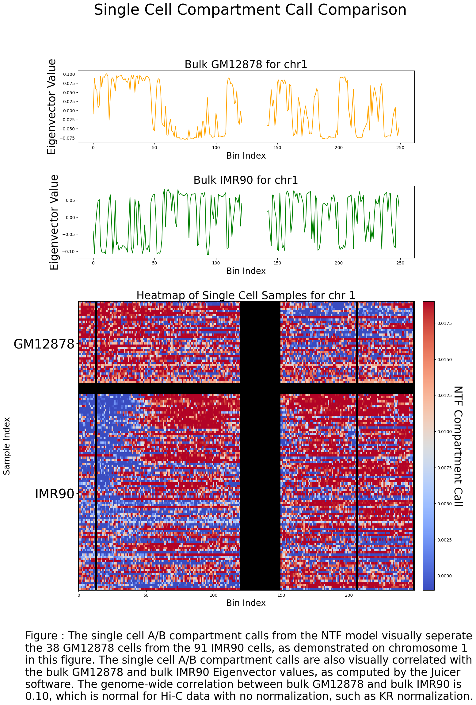

# Hypermatrix

Hypermatrix is a command-line tool designed for the integration of multi-omics data, as well as general epigenetic data analysis using tensor techniques.

The 'ABcluster' command processes single-cell CpG methylation and single-cell chromosome conformation data to perform cell-type clustering, single-cell A/B compartment identification, and single-cell TAD boundary detection. This command is compatible with data from techniques like sn-m3C-seq (as described by Dong-Sung Lee et al. in Nature Methods, 2019) and the single-cell version of NOMe-HiC (described by Hailu Fu et al. in Genome Biology, 2023). 'ABcluster' is particularly useful for tracking the diversity of A/B compartments within cells of the same type. This tool can be used to test the hypothesis that the diversity in A/B compartments within a cell-type increases with the age of an organism.

The 'differentiate_chromosomes' command processes Hi-C data, optionally combined with other epigenetic modalities, to produce distinct A/B compartment calls for each homologous chromosome. Unlike 'ABcluster', which relies solely on intrachromosomal contacts, 'differentiate_chromosomes' uses both intra- and interchromosomal contacts. The folding of chromatin in 3D space is an important part of gene regulation, ensuring that certain genes are transcribed simultaneously and that their transcripts are spatially close for further processing. The 'differentiate_chromosomes' command can be used to test the hypothesis that diploid cells use two distinct regulatory configurations for each homologous chromosome, with each 3D conformation likely being mutually exclusive to the other. For example, for one folding program to position certain genes in an active transcriptional hub, it may have to seperated other genes that also need to be clustered. Diploidy provides a solution to this problem. Diploidy offers more than just a backup copy of each chromosome; it provides cells with additional regulatory complexity by enabling the use of two mutually exclusive folding programs simultaneously. Additionally, the 'differentiate_chromosomes' command measures the degree to which each chromosome is associated with the nuclear lamina.

Advancements in single-cell multi-omics technologies have enabled the simultaneous measurement of various omics modalities within individual cells. Integrating multi-omics data while preserving the interaction information between different modalities remains an open challenge. Traditional methods lose critical interaction information by applying matrix methods. To address this, this project proposes a Non-Negative Tensor Factorization (NTF) model for multi-omics integration called 'Hypermatrix'.

## Visualization

Below is the heatmap comparing the bulk eigenvectors of GM12878 and IMR90 with single-cell compartment calls. The first 38 cells are GM12878.

  

## Installation

### Prerequisites

Ensure you have `conda` installed. If not, you can install it from [here](https://docs.conda.io/projects/conda/en/latest/user-guide/install/index.html).

### Steps

1. Clone the repository:

    ```bash
    git clone https://github.com/DavidWarrenKatz/hypermatrix.git
    ```

2. Create the conda environment:

    ```bash
    conda env create -f hypermatrix/bin/hypermatrix.yml
    ```

3. Activate the environment:

    ```bash
    conda activate hypermatrix
    ```

4. As a first demonstration, derive A/B compartments from integrated bulk epigenetic data and synthetic data to illustrate the non-negative tensor decomposition method. Navigate to the utilities directory:

    ```bash
    cd hypermatrix/utilities
    ```

5. Make the `runPipeline_bulkdata.sh` script executable:

    ```bash
    chmod +x runPipeline_bulkdata.sh
    ```

6. Run the `runPipeline_bulkdata.sh` script to get the necessary data:

    ```bash
    ./runPipeline_bulkdata.sh
    ```

## Usage

After setting up the environment and downloading the necessary data, you can start using the HYPERMATRIX tool. Below are detailed usage instructions, including example commands or scripts that users can run.

### ABcluster Command

To perform cell-type clustering, A/B compartment calls, and TAD boundary calls:

```bash
python ABcluster.py --methylation_file <path_to_methylation_file> --conformation_file <path_to_conformation_file> --output_dir <output_directory>
```

#### Arguments

- `--methylation_file`: Path to the single-cell CpG methylation file.
- `--conformation_file`: Path to the chromosome conformation file.
- `--output_dir`: Directory where the output files will be saved.

#### Output

The output directory will contain:

- `cell_type_clusters.txt`: Clustering results for each cell.
- `ab_compartments.txt`: A/B compartment calls for each cell.
- `tad_boundaries.txt`: TAD boundary calls for each cell.

#### Example Command

```bash
python ABcluster.py --methylation_file data/methylation.csv --conformation_file data/conformation.csv --output_dir results/
```

### differentiate_chromosomes Command

To differentiate between the homologous chromosomes and determine if B compartments are lamina-associated:

```bash
python differentiate_chromosomes.py --input <path_to_input_file> --output <output_directory>
```

#### Arguments

- `--input`: Path to the input file containing chromosome data.
- `--output`: Directory where the output files will be saved.

#### Output

The output directory will contain:

- `homologous_chromosomes.txt`: Differentiated homologous chromosomes.
- `lamina_associated_B_compartments.txt`: B compartments that are lamina-associated.

#### Example Command

```bash
python differentiate_chromosomes.py --input data/chromosome_data.csv --output results/
```

## Contact

For any questions or issues, please contact davidkatz02@gmail.com.
